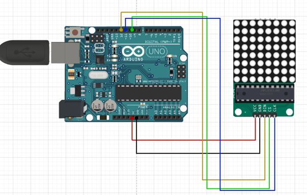
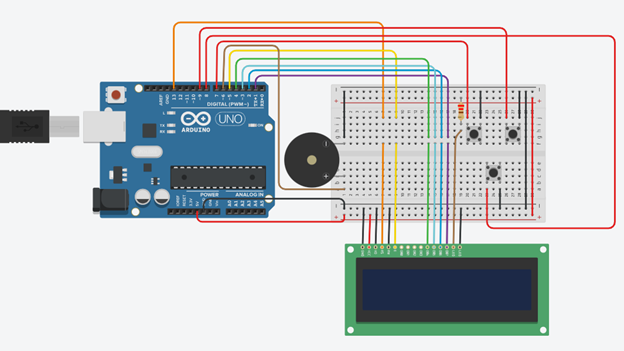
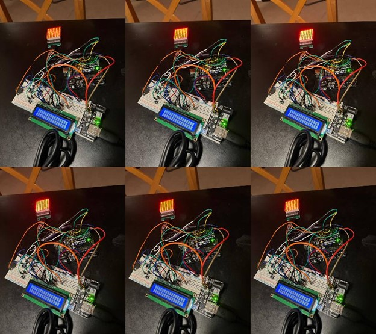
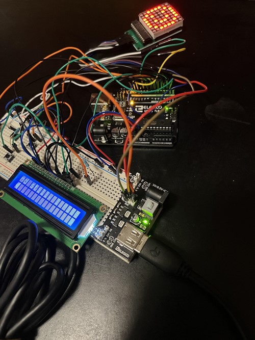
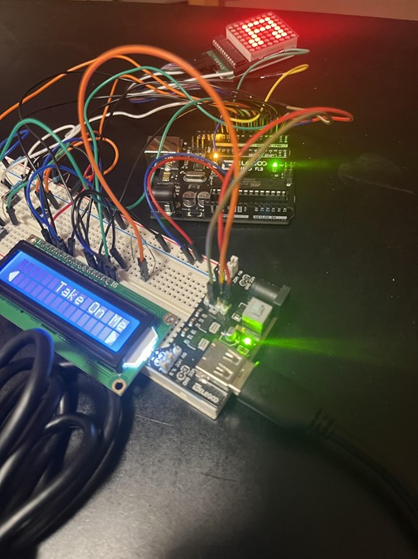
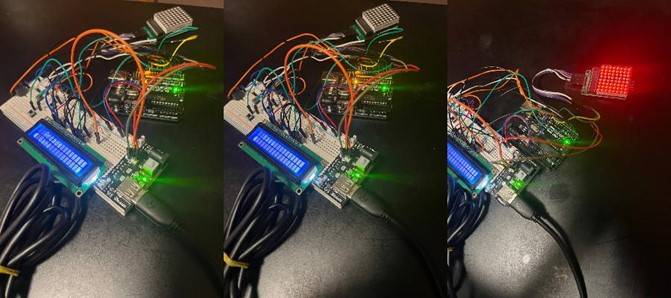
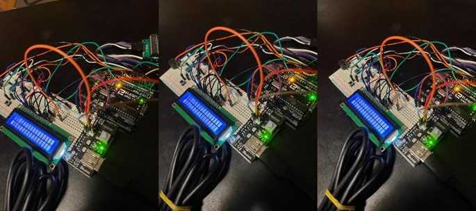

# StressReliever
Interactive project meant to distract from and relieve stress.
#### Video Demo
https://www.youtube.com/watch?v=dzWFiDtVErs&t=25s

## Purpose
Welcome to Stress Reliever! This is an interactive project whose purpose is to relieve anxiety and stress by engaging you and distracting you from your worries, even if just for a second. I was inspired to do this project because of the loved ones around me who get overtaken by anxiety, and also because of my continuously high levels of stress. With this project, I hope to alleviate these overwhelming feelings.
This version of Stress Reliever comes with 4 main functions:

* Breathing Exercise
* Motivational Phrases
* Song Melodies
* Arcade Game

Any one of these can be selected and played around with. 
The Breathing Exercise function instructs you to inhale, hold your breath, and then exhale. This is meant to help you control your breathing and heart rate if you feel like they are out of control. 
The Motivational Phrases function displays some pre-loaded phrases that are meant to cheer you up a bit. 
The Song Melodies function plays tune melodies of some songs, with the hopes of distracting you and getting the melody stuck in your head. 
Lastly, the Arcade Game function allows you to play a game I created for my past project, Labitynth! In this game, you must traverse the maze and reach the exit without dying.

## Components

* Arduino Uno
* Jumper wires
* 3 push buttons
* 8x8 LED Matrix with MAX7219
* Active Buzzer
* LCD 1602

## LED Matrix Circuit Schematic

## Circuit Schematic for Remaining Components

## Implementation and Functionality

  #### Breathing Exercise
  I implemented all of my functions using the state machine computational model. Firstly, I implemented the Breathing Exercise. When this function is selected, the exercise begins and the LCD shows the word “INHALE” while a timer is displayed below it, counting down 5 seconds. At the same time, the LED matrix lights up and increases in brightness with each passing second. Once the 5 seconds are over, the LCD then displays “HOLD” with a 4 second timer below it. The LED matrix remains at the same brightness. Once the 4 seconds are up, the LCD then shows “EXHALE” and counts down 5 seconds, while the LED matrix decreases in brightness. After this, it returns back to waiting for user input.
  
 
  
  #### Motivational Phrases
  After this, I implemented the Motivational Phrases, which just lets you scroll through some pre-saved phrases. To do this I created a 2D character array to hold the phrases, and I used the LCD autoscroll() function to shift in the phrases from the right and display them. I did this so I could display phrases as long as I wanted. When the function starts, the very first phrase is displayed, after which you can use two of the buttons to scroll through the phrase options, or the third one to exit. The function detects the button input and adjusts which phrase is being displayed. If you try to go out of bounds of the array, either the first or the last phrase are displayed. While this function is running I also had the LED Matrix display a happy face. 
  
 
  
  #### Song Melodies
  Next, I implemented the Songs function. For this, I had to have a 2D array for the song names, and then also an individual array for each song to hold the different note frequencies the buzzer must play to replicate the song. When you choose this function, you can use the buttons to scroll through the song options and select one.  Once a song is chosen, it plays the melody by traversing the frequencies array and playing each note for a certain duration. When it is over, you are brought back to the function selection menu. While the song is playing, a music note is displayed on the LED Matrix. 
  
 
  
  #### Aracade Game
  The last main function I implemented was the arcade game. This game is a project I had previously worked on, called Labitynth. Initially, I had planned to only include the first level, but after doing so I realized that it was only a bit more to implement the whole game, so I went ahead and included the whole thing. This was easier than I had anticipated, as the game code was very well organized and maintained, so I only had to copy it over, add it as an option to the functions menu, and then just had to make sure the game was triggered and also ended properly. I also decided to add difficulty settings to this version of the game. I let you choose between three difficulties: easy, medium, or hard. These three difficulties correspond to the game having 1, 3, and 5 levels respectively. If you pass all the levels without dying three times, you win the game, otherwise you lose. 
  
 
  
  #### Menu
  Lastly, I created a Menu function for you to be able to select the main functions. This function allows you to scroll through the names of the main functions and select one. When one is chosen, a global variable is set, which then calls the appropriate function in the main loop. For this function and the others where you can scroll, I created and displayed a left and right arrow characters to indicate that you can traverse the options.
  
 
  
 ## Testing
  For this project, most of my testing involved the LCD, since I had not used it before. I had to experiment with how much power to give to the LCD to properly light up the screen while also powering the LED Matrix. I had to test how to display text in different parts of the display, how to move it, how to make it scroll, and how to display special custom characters, like the arrows. 
Besides this, I had little need for testing because of my incremental development approach to this project. I designed and implemented each of the main functions independently from each other, making sure that one was fully functional before moving on to the next. Most of the bugs I encountered were resolved by: revising and fixing code logic or state machine design, doing some rewiring, or using the Arduino Serial() function to output to the console and observe code behavior. 

## Challenges & Lessons Learned
I think that my biggest challenge in this project was to put all my different functions together into one, and to adapt all of them to work with the simple setup that I have. Thus, from this project I learned that it is important to have clean, maintainable code to facilitate implementation and to reduce unnecessary work.
